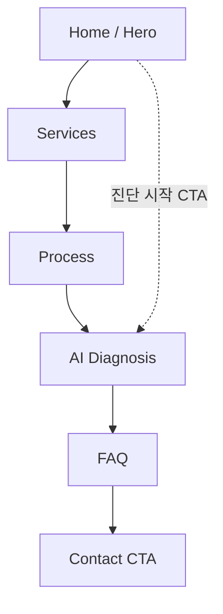
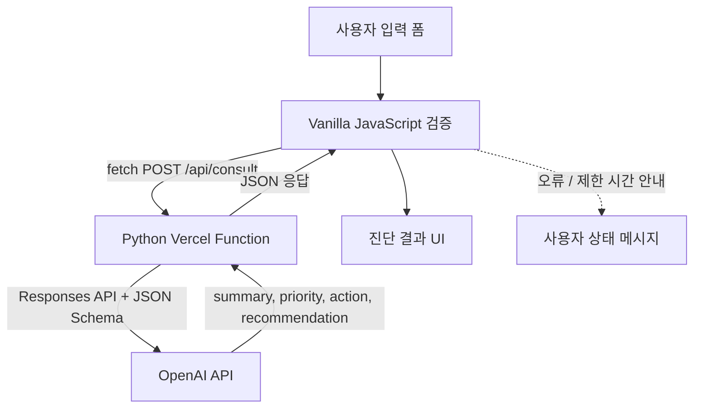

# AX Ground 와이어프레임

## 사이트 정보 구조

```mermaid
flowchart TD
    Home[Home / Hero] --> Services[Services]
    Services --> Process[Process]
    Process --> Diagnosis[AI Diagnosis]
    Diagnosis --> FAQ[FAQ]
    FAQ --> Contact[Contact CTA]
    Home -. 진단 시작 CTA .-> Diagnosis
```

상단 메뉴는 Services, Process, AI Diagnosis, FAQ로 이동합니다. AX Ground 로고는 Home으로 연결되고, 페이지 하단 Contact CTA는 AI 간이진단으로 안내합니다.

## AI Diagnosis 요청 흐름

```mermaid
flowchart TD
    Form[사용자 입력 폼] --> JS[Vanilla JavaScript 검증]
    JS -->|fetch POST /api/consult| Function[Python Vercel Function]
    Function -->|Responses API + JSON Schema| OpenAI[OpenAI API]
    OpenAI -->|summary, priority, action, recommendation| Function
    Function -->|JSON 응답| JS
    JS --> Result[진단 결과 UI]
    JS -. 오류 / 제한 시간 안내 .-> Status[사용자 상태 메시지]
```
